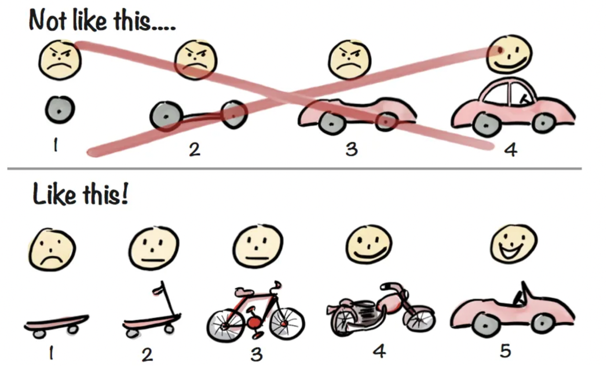
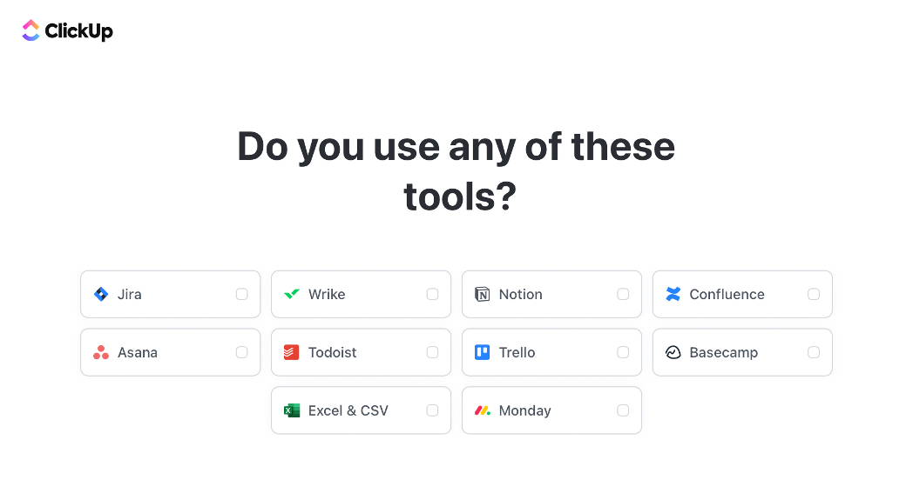
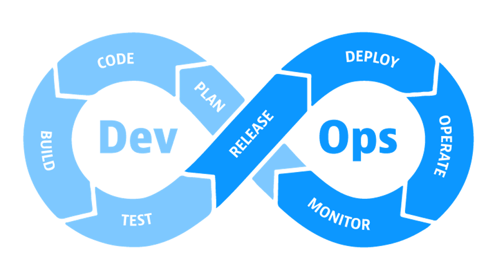
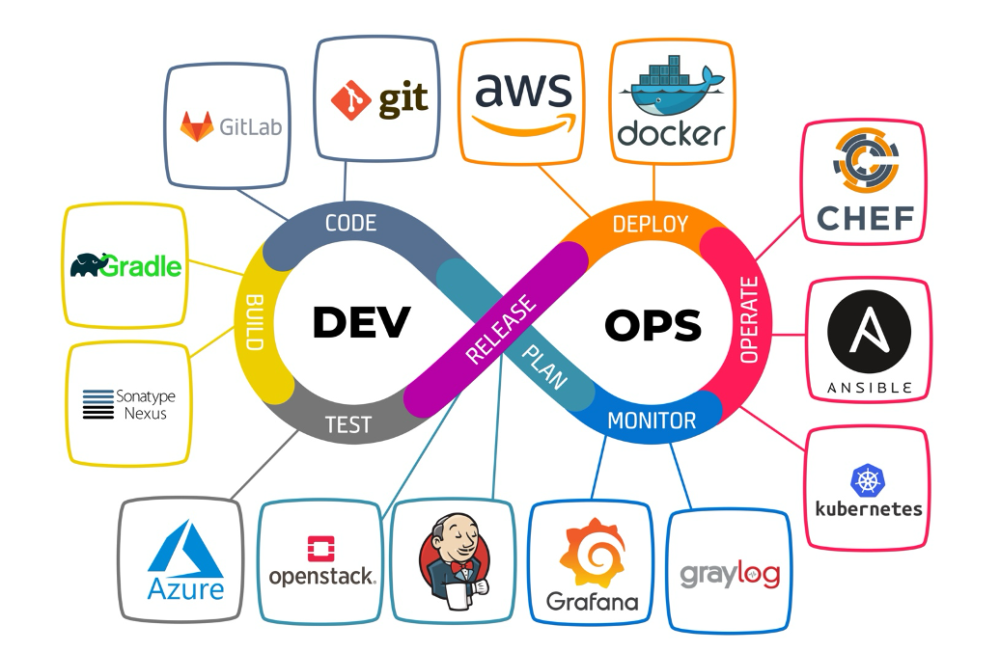
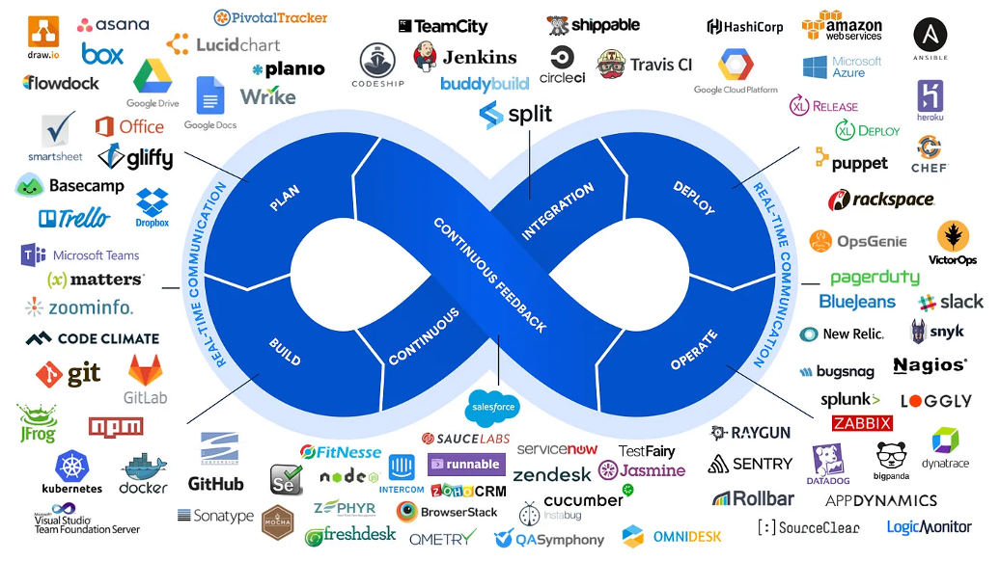

# Week 4 – Software Development Processes / AGILE and DEVOPS

**The Software Development Life Cycle (SDLC)** is a systematic process used for designing, developing, testing, and deploying software applications. It provides a structured approach to software development, ensuring that high-quality software is delivered efficiently and meets user requirements. Here are the key phases of the SDLC:

**1. Planning:**

- **Objective:** Define the scope, goals, and purpose of the project. 
- **Activities:**
    - Conduct feasibility studies.
    - Gather initial requirements and create a project plan.
    - Estimate resources, time, and budget.

**2. Requirements Analysis:**

- **Objective:** Understand and document the functional and non-functional requirements of the software.
- **Activities:**
    - Engage with stakeholders to gather detailed requirements.
    - Create use cases, user stories, and functional specifications.
    - Validate requirements for completeness and feasibility.

**3. Design:**

- **Objective:** Plan the architecture and design of the software system.
- **Activities:**
    - Design the system architecture, including database and user interface design.
    - Create detailed design documents, flowcharts, and diagrams.
    - Specify hardware and software requirements.

**4. Implementation (Coding):**

- **Objective:** Translate design documents into executable code.
- **Activities:**
    - Write code using appropriate programming languages and tools.
    - Adhere to coding standards and guidelines.
    - Conduct unit testing to ensure code quality and functionality.

**5. Testing:**

- **Objective:** Verify that the software meets the specified requirements and identify any defects.
- **Activities:**
    - Perform different types of testing, including unit, integration, system, and acceptance testing.
    - Use automated and manual testing methods.
    - Document and fix defects found during testing.

**6. Deployment:**

- **Objective:** Deliver the completed software to the end-users.
- **Activities:**
    - Prepare the production environment.
    - Deploy the software application to live environments.
    - Conduct user training and provide documentation.

**7. Maintenance:**

- **Objective:** Ensure the software remains functional and relevant after deployment.
- **Activities:**
    - Monitor software performance and address any issues or bugs.
    - Implement updates and enhancements based on user feedback.
    - Provide ongoing support and maintenance.

## Models of SDLC

There are several models used to guide the SDLC process, each with its own approach to these phases:

- **Waterfall Model:** A linear, sequential approach where each phase must be completed before moving to the next.
- **Agile Model:** An iterative and incremental approach that focuses on flexibility, collaboration, and customer feedback.
- **Spiral Model:** Combines iterative development with risk assessment, focusing on repeated refinement through multiple iterations.
- **V-Model (Validation and Verification):** An extension of the Waterfall model that emphasizes validation and verification at each stage.
- **Iterative Model:** Develops the system through repeated cycles (iterations) and smaller portions at a time.

Each model has its strengths and is chosen based on the project's requirements, complexity, and the level of flexibility needed. The SDLC provides a clear framework that helps ensure software quality, efficiency, and effectiveness.

> https://www.tutorialspoint.com/sdlc/index.htm

**Choosing the right Software Development Life Cycle (SDLC) model** is crucial for the success of a software project. The choice depends on various factors, including project requirements, complexity, timeline, and team dynamics. Here’s a guide to help you select the most suitable SDLC model for your project:

**Factors to Consider**

1.	**Project Requirements:**
    - Well-Defined Requirements: If requirements are clear and unlikely to change, the Waterfall model might be suitable.
    - Evolving Requirements: If requirements are expected to change or are not fully understood, Agile or Spiral models are better options.

2.	**Project Complexity and Size:**
    - Simple Projects: Smaller, straightforward projects can benefit from the Waterfall or Iterative models.
    - Complex Projects: Large, complex projects with high uncertainty are better suited for Agile or Spiral models, which handle complexity and change well.

3.	**Time Constraints:**
    - Fixed Deadlines: If the project has a strict deadline, the Waterfall model provides a clear timeline.
    - Flexible Deadlines: Agile models allow for adaptive planning and can accommodate changes throughout the development process.

4.	**Risk Management:**
    - High-Risk Projects: Projects with significant risks benefit from the Spiral model, which focuses on risk assessment and mitigation.
    - Low-Risk Projects: Simpler models like Waterfall or Iterative can be used when risks are minimal.

5.	**Customer Involvement:**
    - High Customer Involvement: Agile models require frequent collaboration and feedback from customers.
    - Low Customer Involvement: Waterfall or V-Model can be used if customer involvement is minimal after initial requirements are set.

6.	**Team Expertise and Experience:**
    - Experienced Teams: Agile models are suitable for teams familiar with iterative and flexible processes.
    - Less Experienced Teams: More structured models like Waterfall or V-Model provide clear guidelines and may be easier to follow.

## Minimum Viable Product (MVP)

A Minimum Viable Product (MVP) is the simplest version of a product that can be built to validate a product idea. It focuses on delivering the core value proposition to early adopters, allowing for rapid feedback and iteration. The goal is to learn as quickly as possible about what customers want and need, without investing heavily in features that may not be valuable. 

**Key Characteristics of an MVP:**
- Core functionality: Includes only the essential features to solve a problem.
- Rapid development: Built quickly and efficiently to get to market fast.  
- Feedback-driven: Used to gather user feedback and insights.   
- Iterative: Continuously improved based on user feedback. 

### What are some examples of MVPs?

The MVP isn’t just a testing ground or prototype that gets dismissed in the long run, though. There are plenty of products and services on the market that started off as MVPs and expanded into institutions in their own right.

**Amazon**

In the early 90s, Jeff Bezos read that the e-commerce industry would be the next big venture in sales and took the opportunity to discover which markets would be most successful. He eventually landed on a bookstore as the minimum viable product, which he ran from his garage. The success of his bookstore led to the demand for other products, like electronics, clothing, and shoes. It was his first step — using books as the MVP — that gave him the customer insight to take Amazon to the next level. Who would have thought that a small bookstore on a basic webpage would expand to the third-largest enterprise in the world in just 20 short years?

**Uber**

Yes, the ride-sharing app we all know and love didn’t start as a mobile app. In fact, founders Garret Camp and Travis Kalanick took advantage of the idea of an MVP to develop an iPhone-only SMS service called UberCab in San Francisco. They tested the user experience and refined it within the city before they were able to gather venture capital and build the app that services 19 million trips around the world each day.
Uber has gone through various iterations, increasing its scope year by year using the feedback collected from its customer base. While UberCab launched with just taxis, Uber in its second wave incorporated black cars and independent contractors as drivers to build the ridesharing experience we all know and use today. Through various iterations, we’ve seen Uber expand way beyond the MVP to include pooled rideshare, accessible ride options, and in some small markets, even helicopters.

**Spotify**

In 2006, streaming services were starting and failing over and over again due to limited and low-quality libraries, high subscription prices, and unstable streaming. So Daniel Ek and Martin Lorentzon built Spotify as a landing page where they could test their streaming technology to beta users and fund it with on-page ad revenue. Their ultimate goal was to make playback fast and stable so they could convince music labels and investors of the product’s quality. Once they got through market testing, Spotify and its subsequent app was released to the public to become the streaming behemoth we now know.

**Airbnb**

With no money to build a business, the founders of Airbnb used their own apartment to validate their idea to create a market offering short-term, peer-to-peer rental housing online. They created a minimalist website, published photos and other details about their property, and found several paying guests almost immediately.

**Foursquare**
The location-based social network Foursquare started as just a one-feature MVP, offering only check-ins and gamification rewards. The Foursquare development team began adding recommendations, city guides, and other features until they had validated the idea with an eager and growing user base.

> https://www.atlassian.com/agile/product-management/minimum-viable-product
> https://www.productplan.com/glossary/minimum-viable-product/

## AGILE

Agile is a methodology in software development and project management that emphasizes flexibility, collaboration, and customer satisfaction. It aims to deliver high-quality software through iterative and incremental processes, allowing for rapid adjustments based on stakeholder feedback and changing requirements. Agile is not a single framework but a set of principles and practices that guide how teams work together to produce value efficiently and effectively.

### Agile Principles

The Agile methodology is based on the Agile Manifesto, which outlines four core values and twelve principles:

### Core Values

1.	Individuals and Interactions **over** processes and tools.
2.	Working Software **over** comprehensive documentation.
3.	Customer Collaboration **over** contract negotiation.
4.	Responding to Change **over** following a plan.

### Key Principles

1.	Customer satisfaction through early and continuous delivery of valuable software.
2.	Welcome changing requirements, even late in development.
3.	Deliver working software frequently, with a preference for shorter timescales.
4.	Business people and developers must work together daily throughout the project.
5.	Build projects around motivated individuals and trust them to get the job done.
6.	Face-to-face conversation is the most efficient and effective method of conveying information.
7.	Working software is the primary measure of progress.
8.	Maintain a sustainable development pace.
9.	Continuous attention to technical excellence and good design enhances agility.
10.	Simplicity is essential, maximizing the amount of work not done.
11.	The best architectures, requirements, and designs emerge from self-organizing teams.
12.	Regularly reflect on team performance to become more effective.

### Applications of Agile

Agile is widely used across various industries and project types due to its adaptability and focus on customer needs. Here are some common applications:

1. Software Development:
    - Scrum: An Agile framework that organizes work into time-boxed iterations called sprints, typically lasting two to four weeks. Key roles include the Scrum Master, Product Owner, and Development Team.
    - Kanban: Focuses on continuous delivery without prescribed timeboxes. It uses a visual board to track work items and manage workflow.
    - Extreme Programming (XP): Emphasizes technical practices like test-driven development, continuous integration, and pair programming.

2. Project Management:
    - Agile principles are applied to manage projects in industries such as marketing, finance, and human resources.
    - Agile project management tools like Jira, Trello, and Asana help teams plan, track, and collaborate effectively.

3. Product Development:
    - Agile is used to develop products incrementally, allowing for fast prototyping, user feedback, and iterative improvements.
    - Helps in aligning product features with customer needs and market demands.

4. Business Strategy:
    - Agile practices are used to enhance strategic planning and execution, enabling businesses to adapt quickly to market changes.
    - Facilitates continuous improvement and innovation.

5. Operations and Infrastructure:
    - DevOps combines Agile principles with IT operations to improve collaboration between development and operations teams.
    - Focuses on automating processes, continuous integration, and rapid deployment.

### Benefits of Agile

- Flexibility and Adaptability: Agile allows teams to adapt quickly to changes, reducing risks associated with changing requirements.
- Customer Focus: Frequent feedback loops ensure that the final product meets customer needs and expectations.
- Improved Collaboration: Agile promotes open communication and collaboration among team members and stakeholders.
- Faster Time to Market: Incremental deliveries ensure that valuable features reach users sooner.
- Enhanced Quality: Continuous testing and integration improve product quality and reduce defects.

### Challenges of Agile
- Cultural Shift: Requires a shift in mindset and culture, which can be difficult for traditional organizations.
- Scalability: Scaling Agile practices to large organizations or distributed teams can be challenging.
- Resource Management: Balancing resources and managing workload can be complex in an Agile environment.

Overall, Agile is a versatile approach that can be adapted to various project types and industries, offering a way to manage uncertainty and deliver value continuously.

### Core Agile Terms

- Agile Manifesto: A set of values and principles that guide Agile development.
- Agile Framework: A structured approach to implementing Agile principles, such as Scrum, Kanban, or Extreme Programming (XP).
- Iteration: A short development cycle, typically lasting 2-4 weeks, where a specific set of features is developed and released.
- Increment: A shippable product or feature delivered at the end of an iteration.
- Backlog: A prioritized list of work items to be completed.
- Sprint: A time-boxed period (usually 2-4 weeks) during which a team works to complete a set of work items.

### Scrum-Specific Terms

- Product Owner: The person responsible for maximizing the value of the product.
- Scrum Master: The facilitator of the Scrum process.
- Development Team: A self-organizing team responsible for delivering the product.
- Daily Scrum: A daily meeting where the team discusses progress, challenges, and plans for the day.
- Sprint Planning: A meeting to plan the work for the upcoming sprint.
- Sprint Review: A meeting to demonstrate the completed work and gather feedback.
- Sprint Retrospective: A meeting to reflect on the past sprint and identify improvements.
- Burndown Chart: A visual representation of the work remaining in a sprint.

### Additional Agile Terms

- User Story: A description of a desired feature from the user's perspective.
- Acceptance Criteria: The conditions that must be met for a user story to be considered complete.
- Epic: A large body of work that can be broken down into smaller user stories.

## DEVOPS

DevOps is a set of practices that combines software development (Dev) and IT operations (Ops) to shorten the development life cycle and provide continuous delivery with high software quality. It emphasizes collaboration and communication between developers and IT professionals while automating the process of software delivery and infrastructure changes.

### Key Principles of DevOps:

1.	Collaboration: Encourages close cooperation between development and operations teams.
2.	Automation: Automates repetitive tasks to increase efficiency and reduce errors.
3.	Continuous Integration/Continuous Deployment (CI/CD): Integrates code changes frequently and deploys them automatically.
4.	Monitoring and Logging: Continuously monitors applications and infrastructure to identify and resolve issues quickly.
5.	Infrastructure as Code (IaC): Manages infrastructure using code and software development techniques.

### Applications of DevOps:

1.	Continuous Integration and Delivery: Automating the build, test, and deployment processes to ensure rapid and reliable delivery of software.
2.	Microservices: Facilitates the development and management of microservices architectures by automating their deployment and scaling.
3.	Cloud Computing: Enhances the management and deployment of applications on cloud platforms, utilizing the scalability and flexibility of cloud resources.
4.	Infrastructure Management: Uses Infrastructure as Code to provision and manage infrastructure efficiently, reducing manual interventions.
5.	Security: Integrates security practices into the DevOps process, often referred to as DevSecOps, ensuring that security is an integral part of the software development lifecycle.
6.	Monitoring and Logging: Implements robust monitoring and logging solutions to track application performance and detect issues in real-time.

By adopting DevOps practices, organizations can achieve faster delivery of software, improved quality, and better alignment between development and operations, ultimately leading to enhanced customer satisfaction.

***DevOps processes** involve a set of practices and tools designed to automate and improve the collaboration between software development and IT operations teams. These processes aim to deliver software more efficiently and reliably. Here are some of the key processes in DevOps:

1.	Continuous Integration (CI):
    - Definition: Developers frequently integrate code changes into a shared repository.
    - Goal: Detect and address integration issues early.
    - Tools: Jenkins, Travis CI, GitLab CI, CircleCI.

2.	Continuous Delivery (CD):
    - Definition: Extends CI by automating the release process so that code changes can be deployed to production environments reliably.
    - Goal: Ensure that software can be released at any time.
    - Tools: Jenkins, Bamboo, GitLab CI/CD.

3.	Continuous Deployment:
    - Definition: Every change that passes automated tests is automatically deployed to production.
    - Goal: Minimize manual intervention and reduce time-to-market.
    - Tools: Spinnaker, AWS CodeDeploy.

4.	Infrastructure as Code (IaC):
    - Definition: Managing and provisioning infrastructure using machine-readable definition files, rather than physical hardware configuration.
    - Goal: Ensure consistency and reduce errors in infrastructure management.
    - Tools: Terraform, Ansible, Chef, Puppet.

5.	Configuration Management:
    - Definition: Maintaining consistency of a product's performance, functional, and physical attributes with its requirements, design, and operational information.
    - Goal: Standardize resource configurations and enforce their state across IT infrastructure.
    - Tools: Chef, Puppet, Ansible, SaltStack.

6.	Monitoring and Logging:
    - Definition: Continuously observing and recording system performance and health.
    - Goal: Quickly detect and diagnose issues.
    - Tools: Prometheus, Grafana, ELK Stack (Elasticsearch, Logstash, Kibana), Splunk.

7.	Version Control:
    - Definition: Managing changes to source code over time.
    - Goal: Facilitate collaboration and maintain a history of code changes.
    - Tools: Git, SVN, Mercurial.

8.	Automated Testing:
    - Definition: Using software tools to execute tests on the application automatically.
    - Goal: Ensure the quality and functionality of the software.
    - Tools: Selenium, TestNG, JUnit.

9.	Collaboration and Communication:
    - Definition: Enhancing teamwork and communication between development, operations, and other stakeholders.
    - Goal: Break down silos and foster a culture of shared responsibility.
    - Tools: Slack, Microsoft Teams, Confluence. 

